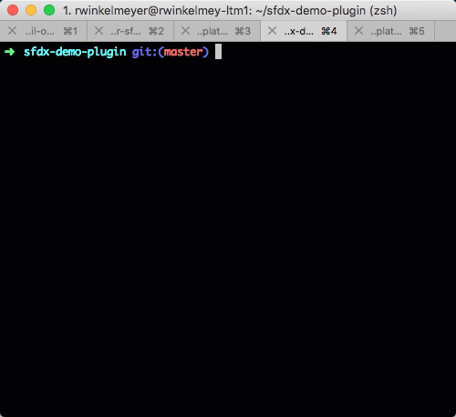

sfdx-plugins-org_open_browser
=============================

Open a Salesforce org into a specified browser or multiple browsers.

My first Salesforce CLI plugin; an expirement in building a plugin.

# Requirements

You will need the Salesforce CLI installed; the Salesforce CLI contains a Yeoman generation to help you build the basic plugin scaffolding.

Salesforce CLI is an npm package called sfdx-cli. You run it on your local machine or continuous integration (CI) system. It supports the installation of custom plug-ins. Most of the core functionality that Salesforce provides comes from plug-ins.

All Salesforce CLI commands start with sfdx. To see which sfdx-cli version you’re using, run sfdx version. To see the available sets of commands—also known as namespaces or top-level topics—run sfdx --help.

# Development

Developing a Salesforce CLI is documented on the [Salesforce Blog](https://developer.salesforce.com/blogs/2018/05/create-your-first-salesforce-cli-plugin.html). In case of any dead links here is a summary of how to create a Salesforce CLI plugin.

By executing the Salesforce CLI command sfdx plugins:generate, the plugin wizard leads you through the configuration steps for the new project and generates the plugin project in the current directory:



When developing the plugin you will need to "compile" it with yarn or npm.

For older versions of the plugin use the prepare script
```
npm run-script prepare
```

On newer versions of the plugin use the prepack script
```
yarn prepack
```

Note that yarn and npm are interchangeable but with npm you have to specify run-script.

Running the code as you develop is achieved by using the run script in the bin folder

```
./bin/run -h
```

# How this plugin works

This plugin works by running `sfdx force:org:open -r --json` to obtain the the Salesforce org url.

Obviously we have a dependency on the libraries that run the force:org:open such as 
```
import * as existingCommand from 'sfdx/lib/commands/force/apex/test/run'

export default extends Command {
  async run() {
    await existingCommand.run()
  }
}
```

The relevant library is in the node_modules after all but these libraries have changed over time, Salesforce CLI maintainers have given no guarantee on there interfaces or behaviors and I did not want to rely on them.

# Installation

The easiest way to install the plugin is to download the source and link it to the Salesforce CLI core

```
sfdx plugins:link directory
```
Where directory is the root of the Salesforce CLI plugin source

# Usage

Modified version of force:org:open to allow you to specify the browser

```
USAGE
  $ sfdx chrisgit:org:open [-b <array>] [-d] [--version <version>] [-u <string>] [--apiversion <string>] [--json] 
  [--loglevel trace|debug|info|warn|error|fatal|TRACE|DEBUG|INFO|WARN|ERROR|FATAL]

OPTIONS
  -b, --browsers=browsers                                                           Please enter a browser, browsers or
                                                                                    leave empty for system default
                                                                                    browser

  -d, --devconsole                                                                  Opens developer console in a browser
                                                                                    rather than org setup

  -u, --targetusername=targetusername                                               username or alias for the target
                                                                                    org; overrides default target org

  --apiversion=apiversion                                                           override the api version used for
                                                                                    api requests made by this command

  --json                                                                            format output as json

  --loglevel=(trace|debug|info|warn|error|fatal|TRACE|DEBUG|INFO|WARN|ERROR|FATAL)  [default: warn] logging level for
                                                                                    this command invocation

  --version                                                                         show CLI version

EXAMPLES
  $ Single browser                   ->  sfdx chrisgit:org:open -u scratchOrg -b iexplore
  $ Single browser developer console ->  sfdx chrisgit:org:open -u scratchOrg -b iexplore --devconsole
  $ Multiple browsers                ->  sfdx chrisgit:org:open -u scratchOrg -b "firefox, edge, chrome"
  $ Multiple browsers                ->  sfdx chrisgit:org:open -u scratchOrg -b firefox,edge,chrome
```

_See code: [src\commands\chrisgit\org\open.ts](https://github.com/chrisgit/sfdx-plugins-org_open_browser/blob/v1.0.0/src\commands\chrisgit\org\open.ts)_
<!-- commandsstop -->
<!-- debugging-your-plugin -->
# Debugging your plugin
We recommend using the Visual Studio Code (VS Code) IDE for your plugin development. Included in the `.vscode` directory of this plugin is a `launch.json` config file, which allows you to attach a debugger to the node process when running your commands.

To debug the `hello:org` command: 
1. Start the inspector
  
If you linked your plugin to the sfdx cli, call your command with the `dev-suspend` switch: 
```sh-session
$ sfdx hello:org -u myOrg@example.com --dev-suspend
```
  
Alternatively, to call your command using the `bin/run` script, set the `NODE_OPTIONS` environment variable to `--inspect-brk` when starting the debugger:
```sh-session
$ NODE_OPTIONS=--inspect-brk bin/run hello:org -u myOrg@example.com
```

2. Set some breakpoints in your command code
3. Click on the Debug icon in the Activity Bar on the side of VS Code to open up the Debug view.
4. In the upper left hand corner of VS Code, verify that the "Attach to Remote" launch configuration has been chosen.
5. Hit the green play button to the left of the "Attach to Remote" launch configuration window. The debugger should now be suspended on the first line of the program. 
6. Hit the green play button at the top middle of VS Code (this play button will be to the right of the play button that you clicked in step #5).
<br><br>
Congrats, you are debugging!
